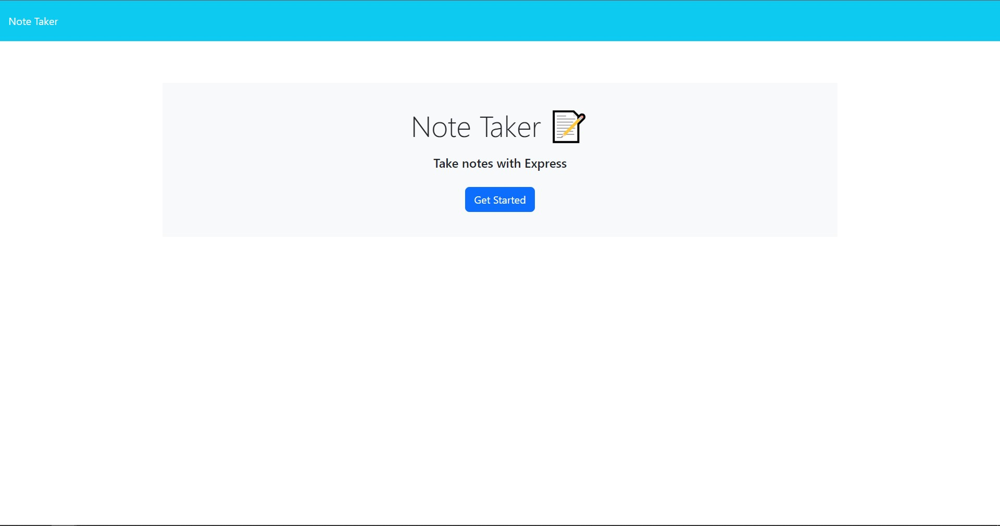
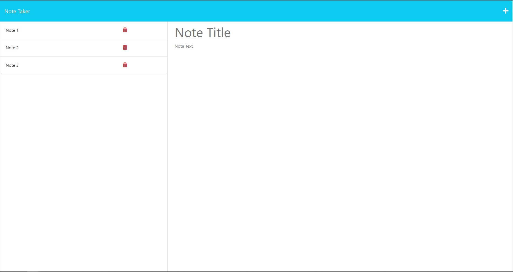

# week-11-Note-Taker

## Purpose of Task

Creation of the back end for a note taker application that can be used to write and save notes. The back end will be built using express.js and the application will be deployed to Heroku.

## User Story

```
AS A small business owner
I WANT to be able to write and save notes
SO THAT I can organize my thoughts and keep track of tasks I need to complete
```


## Acceptance Criteria

```
GIVEN a note-taking application
WHEN I open the Note Taker
THEN I am presented with a landing page with a link to a notes page
WHEN I click on the link to the notes page
THEN I am presented with a page with existing notes listed in the left-hand column, plus empty fields to enter a new note title and the note’s text in the right-hand column
WHEN I enter a new note title and the note’s text
THEN a Save icon appears in the navigation at the top of the page
WHEN I click on the Save icon
THEN the new note I have entered is saved and appears in the left-hand column with the other existing notes
WHEN I click on an existing note in the list in the left-hand column
THEN that note appears in the right-hand column
WHEN I click on the Write icon in the navigation at the top of the page
THEN I am presented with empty fields to enter a new note title and the note’s text in the right-hand column
```

## Problems Solved

- When the application is opened, the user is taken to the homepage
    - Attempting to visit any route other than the routes specified by the back end will send the user back to the homepage
- Clicking on the **Get Started** button will take the user to the notes page
- A save icon appears when the user has provided both a title and text content for their note
    - Clicking the save icon will save the note into a list on the left of the screen
- Clicking any existing notes will load that note's content
- Clicking the **+** icon will create a blank note
- Clicking the red trash can will delete that specific note and update the list of notes
- Using the route /api/notes will show the user the content of all notes and their respective ids
    - Using the route /api/notes/:id, where :id is replaced with the note's id, will show the user only that note's content

## Screenshots

 

 